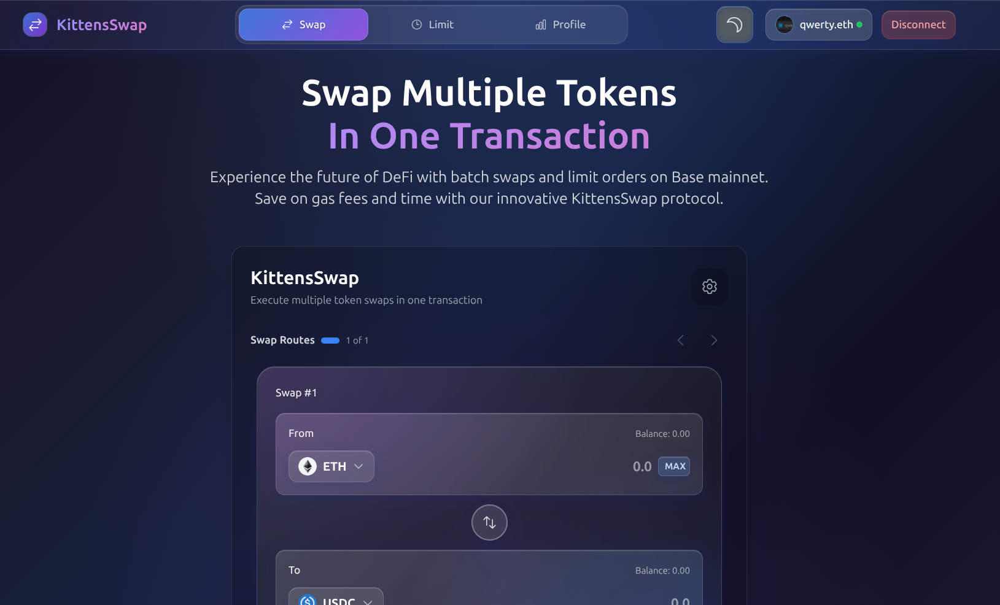

# Base Batch Swap & Limit Orders (1inch + wagmi)

A minimal dApp for:
- Batch swapping multiple tokens in a single transaction (sign once).
- Sending swap outputs to a custom recipient (ENS names supported).
- Creating price-target Limit Orders (single or batch).
- Built for Base mainnet (chainId 8453).



Powered by:
- 1inch Swap API and Limit Order SDK
- wagmi + viem
- EIP-5792 sendCalls (batch transactions)

## Features

- Batch Swap in one go
  - Add multiple swap routes and execute them in one batch.
  - Only one signature/confirmation, fewer popups.
  - Optional receiver: paste a Base address or an ENS name (.eth), we resolve it automatically.
  - Uses 1inch for quotes and calldata, then submits via wagmi sendCalls (EIP-5792).
- Limit Orders
  - Create limit orders with a specified price.
  - Supports partial fills, expiration, and batch creation (several orders at once).
  - Uses 1inch Limit Order SDK (EIP-712 signing + order submission).
- Base-first
  - Defaults to Base mainnet. wagmi config also includes Ethereum mainnet and Sepolia if needed.

## How it works

- Swaps
  - UI: components/SwapInterface.tsx, SimpleBatchSwapButton.tsx
  - Engine: hooks/useSimpleBatchSwap.ts + lib/simple-swap.ts
  - We prepare approve + swap calls per route, then submit them as a single bundle with sendCalls (EIP-5792).
  - Recipient support and ENS resolution via wagmi.
- Limit Orders
  - UI: components/LimitOrdersPanel.tsx
  - Engine: hooks/useLimitOrder.ts (1inch Limit Order SDK)
  - Flow: ensure token allowance → sign typed data (EIP-712) → submit order to 1inch orderbook API.
- Token discovery and balances
  - Token search via 1inch token endpoints.
  - Basic token lists in lib/wagmi.ts (ETH, USDC, WETH, DAI on Base).

## Requirements

- Node 18+ and a modern wallet (EIP-5792 batch support recommended)
- 1inch API key (for real swaps and limit orders; without it, swaps/quotes run in demo mode and limit orders may be limited)
- WalletConnect Project ID
- RPC URLs (optional; public defaults included)

## Quick start

1) Install
- npm install

2) Env
Create .env.local in the project root:
```
NEXT_PUBLIC_WALLETCONNECT_PROJECT_ID=your_walletconnect_project_id
NEXT_PUBLIC_ONEINCH_API_KEY=your_1inch_api_key
```

3) Run
- npm run dev

Open http://localhost:3000, connect your wallet on Base.

## Usage

- Batch Swap
  - Add one or more routes, enter amounts, optionally set a different recipient (Base address or ENS).
  - Adjust slippage/deadline if needed.
  - Click “Swap … Tokens” and sign once.
  - You’ll get a single batch with all approves + swaps. Track it on BaseScan.

- Limit Orders
  - Open the “Limit Orders” tab.
  - For each order: pick tokenIn/tokenOut, enter amount and target price, set expiration and partial fill.
  - Click “Create … Limit Orders”.
  - You’ll approve (if needed) and sign an EIP-712 order message; orders are submitted to 1inch.

## Notes

- Wallet support: Batch execution uses EIP-5792 (sendCalls). Use a provider/wallet that supports it for best UX.
- API key:
  - Without NEXT_PUBLIC_ONEINCH_API_KEY, the app runs in demo mode for swaps (mocked quotes/tx).
  - Limit Orders require an API key for full functionality (1inch orderbook).
- Network: Built for Base mainnet (8453). wagmi config also includes Ethereum mainnet and Sepolia.

## Tech stack

- React/Next.js, TypeScript
- wagmi, viem
- 1inch Swap API and Limit Order SDK
- EIP-5792 batch calls
